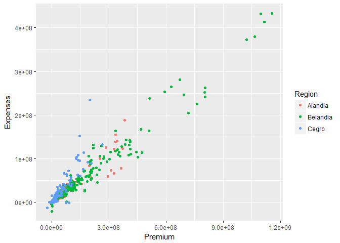
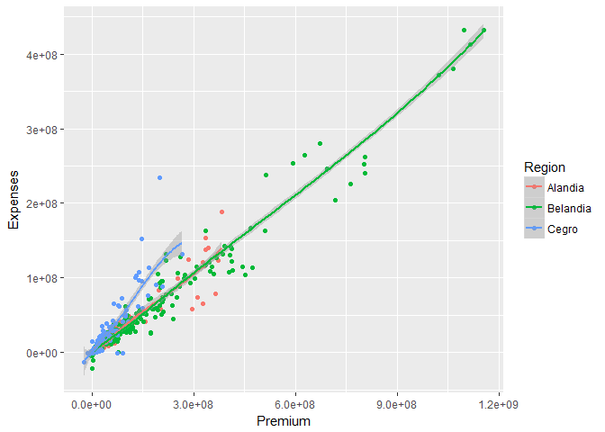

### Exercise - ggplot2
> We will work with the local repository you have cloned in the first (Git) exercise.  
> Open R project for this class in R Studio  
> Run following command in R console to link to `ggplot2` library:
``` r
library(ggplot2)
```
> Load data if you have not done so yet:
``` r
dt_KPI <- read.csv("data/lesson2_KPI.csv")
```
> ggplot2 is based on the grammar of graphics, the idea that you can build every graph from the same components:
* a **data set**,
* a **coordinate system**,
* and **geoms** — visual marks that represent data points.

### First Plot - Scatter
> Now let's try to show our data on simple scatter plot  
``` r
ggplot(data = dt_KPI,aes(x = Premium, y = Expenses)) + geom_point()
```
> We used `ggplot` function specifying **data set** to use, `aes` function to specify aestetics (axes) and geom function `geom_point` to specify how data should be represemeted.  
> Note that we used `+` sign to add layer with points to chart. We will use this technique in future steps as well.  


### Aesthetics and layers

``` r
ggplot(data = dt_KPI) +
  geom_point(mapping = aes(x = Premium, y = Expenses, colour = Region))
```



### Geometric Objects and iheritance of aesthetics

``` r
ggplot(data = dt_KPI,
       mapping = aes(x = Premium, y = Expenses, colour = Region)
) +
geom_point() +
geom_smooth()
```



