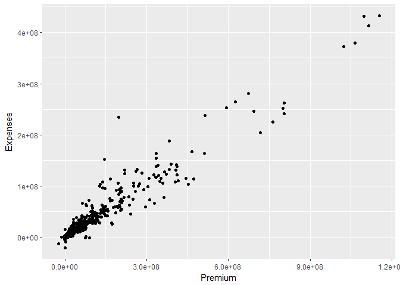

Tidyverse
================

-   collection of very usefull R packages for data wrangling, visualization etc.
-   we will use mainly two, `dplyr` for data preparation and `ggplot2` for visualizations
-   package cheatsheets and simple example, we will not go through details, learning by doing
-   link to literature, vignettes and nice examples

------------------------------------------------------------------------

dplyr - data transformation package
-----------------------------------

`dplyr` is well known package for data tranformation especially in recent R community.

Using concept [grammar of data transformation](https://rstudio-pubs-static.s3.amazonaws.com/153547_3a8e24d4ceeb4868a5f22e70641e8165.html#/) providing consistent set of verbs that help you solve the most common data manipulation challenges.

You can solve ~85% of data manipulation issues using 6 verbs:

-   `mutate()` adds new variables that are functions of existing variables
-   `select()` picks variables based on their names.
-   `filter()` picks cases based on their values.
-   `summarise()` reduces multiple values down to a single summary.
-   `arrange()` changes the ordering of the rows.

These all combine naturally with `group_by()` which allows you to perform any operation "by group". You can learn more about them in `vignette("dplyr")`. As well as these single-table verbs, dplyr also provides a variety of two-table verbs, which you can learn about in `vignette("two-table")`.

### Exercise - dplyr

``` r
library(dplyr)
```

#### Piping

``` r
abs(min(c(1, 4, 2, 8, -5)))
```

    ## [1] 5

vs.

``` r
c(1, 4, 2, 8, -5) %>% min %>% abs
```

    ## [1] 5

#### 6 basic dplyr verbs

``` r
dt_KPI <- read.csv("../../data/lesson2_KPI.csv")

dt_KPI %>% head
```

    ##    Region  Unit Segment  Business Year    Losses  Expenses Premium
    ## 1 Alandia Unit1     Big   Doctors 2012 2520045.7 1158681.0 4739761
    ## 2 Alandia Unit1     Big   Doctors 2013 4272333.6 2051002.6 6086992
    ## 3 Alandia Unit1     Big   Doctors 2014 2212548.6 1613848.3 2668969
    ## 4 Alandia Unit1     Big   Doctors 2015 2408595.1 1719529.1 3741451
    ## 5 Alandia Unit1     Big   Doctors 2016 6189395.3 3831292.8 8451344
    ## 6 Alandia Unit1     Big Criminals 2012  406094.8  309548.2 2755107

``` r
dt_KPI %>% 
  mutate(Combined = Losses + Expenses) %>% head
```

    ##    Region  Unit Segment  Business Year    Losses  Expenses Premium
    ## 1 Alandia Unit1     Big   Doctors 2012 2520045.7 1158681.0 4739761
    ## 2 Alandia Unit1     Big   Doctors 2013 4272333.6 2051002.6 6086992
    ## 3 Alandia Unit1     Big   Doctors 2014 2212548.6 1613848.3 2668969
    ## 4 Alandia Unit1     Big   Doctors 2015 2408595.1 1719529.1 3741451
    ## 5 Alandia Unit1     Big   Doctors 2016 6189395.3 3831292.8 8451344
    ## 6 Alandia Unit1     Big Criminals 2012  406094.8  309548.2 2755107
    ##   Combined
    ## 1  3678727
    ## 2  6323336
    ## 3  3826397
    ## 4  4128124
    ## 5 10020688
    ## 6   715643

``` r
dt_KPI %>% 
  select(Region, Losses) %>% head
```

    ##    Region    Losses
    ## 1 Alandia 2520045.7
    ## 2 Alandia 4272333.6
    ## 3 Alandia 2212548.6
    ## 4 Alandia 2408595.1
    ## 5 Alandia 6189395.3
    ## 6 Alandia  406094.8

``` r
dt_KPI %>% 
  filter(Business == "Criminals") %>% head
```

    ##    Region  Unit Segment  Business Year    Losses  Expenses Premium
    ## 1 Alandia Unit1     Big Criminals 2012  406094.8  309548.2 2755107
    ## 2 Alandia Unit1     Big Criminals 2013  553705.5 1159439.1 3853190
    ## 3 Alandia Unit1     Big Criminals 2014 1169258.6 1164472.9 4247686
    ## 4 Alandia Unit1     Big Criminals 2015 1870166.5 1035699.5 4980802
    ## 5 Alandia Unit1     Big Criminals 2016 1552076.1 1498643.6 7437430
    ## 6 Alandia Unit1     Big Criminals 2012  141731.1  961888.1 2281195

``` r
dt_KPI %>% 
  arrange(Losses, desc(Premium)) %>% head
```

    ##     Region   Unit Segment Business Year   Losses    Expenses     Premium
    ## 1 Belandia Unit11     Big     <NA> 2016 -9204887   -736449.0   1282337.3
    ## 2    Cegro Unit13     Big     <NA> 2016 -4769805  -1169280.1  89715605.9
    ## 3    Cegro Unit13     Big     <NA> 2014 -2552363   -727952.9         0.0
    ## 4    Cegro Unit14     Big     <NA> 2016 -1930677 -12353445.2 -23717167.9
    ## 5    Cegro Unit14   Small     <NA> 2015 -1862066   1601650.9   -380880.4
    ## 6    Cegro Unit12   Small     <NA> 2016 -1397744   -264918.0 -12588349.4

``` r
dt_KPI %>% 
  summarise(Loss_avg = mean(Losses)) %>% head
```

    ##   Loss_avg
    ## 1 29227137

``` r
dt_KPI %>% 
  group_by(Region) %>% 
  summarise(Loss_avg = mean(Losses)) %>% head
```

    ## # A tibble: 3 x 2
    ##     Region Loss_avg
    ##     <fctr>    <dbl>
    ## 1  Alandia 24001038
    ## 2 Belandia 41959316
    ## 3    Cegro  8317821

ggplot2 - data visualization package
------------------------------------

> “The simple graph has brought more information to the data analyst’s mind than any other device.” — John Tukey

Althoug R has a lot of systems of providing graphics, `ggplot2` is one of the most elegant and most versatile system for visualiaztion in R. ggplot2 implements the [grammar of graphics](http://vita.had.co.nz/papers/layered-grammar.html), a coherent system for describing and building graphs.

### First Plot - Scatter

``` r
library(ggplot2)

ggplot(data = dt_KPI) +
  geom_point(mapping = aes(x = Premium, y = Expenses))
```



### Aesthetics and layers

``` r
ggplot(data = dt_KPI) +
  geom_point(mapping = aes(x = Premium, y = Expenses, colour = Region))
```


### Geometric Objects and iheritance of aesthetics

``` r
ggplot(data = dt_KPI,
       mapping = aes(x = Premium, y = Expenses, colour = Region)
) +
geom_point() +
geom_smooth()
```


Other Material, Literature and Credits
--------------------------------------

[R for Data Science - Data Transformation](http://r4ds.had.co.nz/transform.html#introduction-2)

[R for Data Science - Data Visualization](http://r4ds.had.co.nz/data-visualisation.html)

[dplyr cheatsheet](https://github.com/rstudio/cheatsheets/raw/master/data-transformation.pdf)

[ggplot2 cheatsheet](https://github.com/rstudio/cheatsheets/raw/master/data-visualization-2.1.pdf)
